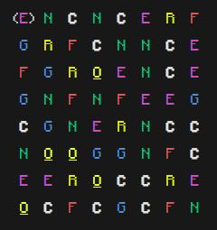
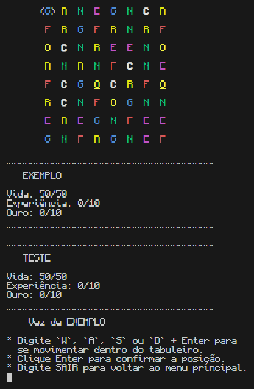

 
<h1 style="text-align: center; font-size: 5.5em; font-family: Garamond, sans-serif; color: white;">Puzzle Quest 
Trabalho de final de semestre da faculdade - UniRitter
</h1>

Introdução

   O trabalho final do primeiro semestre dado para nós, alunos de Ciência da Computação na UniRitter, consiste em uma releitura do jogo <a href="https://pt.wikipedia.org/wiki/Puzzle_Quest:_Challenge_of_the_Warlords">Puzzle Quest</a>, mantendo a maior parte da lógica por trás dele.

   A principal mudança é a diferença na funcionalidade de cada tipo de peça/esfera quando formadas e a ausência de itens, personagens, personalização de personagens e demais coisas desse tipo.

   <small><a href="/assets/proposta.pdf">Clique aqui</a> para acessar o arquivo da proposta do trabalho em PDF</small>

Como Jogar

   Objetivo

   Seu principal objetivo é não ter sua vida zerada, pois assim você garante que você não irá perder, mas, melhor que isso, é ganhar, e para isso você precisa zerar a vida do seu adversário através das esferas dos tipos "caveira" e "experiência", as quais você aprenderá abaixo.

   Esferas

   Há os seguintes tipos de esferas:
   <ul style="font-size:1.3em">
      <li><code>Caveira</code>: A cada caveira formada, um (1) de dano é dado ao inimigo;
      <li><code>Experiência</code>: A cada experiência formada, um (1) de experiência (XP) é creditado ao jogador que a formou. Chegando em 10 experiências, o valor é resetado e o inimigo perde 10 pontos de vida <u>máxima</u>;
      <li><code>Fogo</code>: A cada fogo formado, o jogador que o formou recebe um (1) de vida atual a mais (caso o valor atual seja menor que o valor máximo);
      <li><code>Gelo</code>: Um jogo de gelos transforma todos os fogos em caveiras;
      <li><code>Natureza</code>: Um jogo de naturezas transforma todas as caveiras em fogos;
      <li><code><u>Ouro</u></code>: A cada <u>ouro</u> formado, um (1) de <u>ouro</u> é creditado ao jogador que o formou. Chegando em 10 <u>ouros</u>, o valor é resetado e a próxima jogada desse jogador causa o dobro de dano (caso ocorra esse ataque);
      <li><code>Raio</code>: Um jogo de raios "zera" o <u>ouro</u> do inimigo.
   </ul>

   Comandos

   Mover-se para cima no tabuleiro W + Enter 
   Mover-se para esquerda no tabuleiro A + Enter 
   Mover-se para direita no tabuleiro S + Enter 
   Mover-se para baixo no tabuleiro D + Enter 
   Selecionar esfera / Confirmar inputEnter 
   

Funcionamento

   Tabuleiro

   O tabuleiro é gerado de forma aleatória com o uso da classe <code>Random</code>, própria do Java. Usando estruturas condicionais, estruturas de repetição e métodos de classe também foi possível fazer com que um tabuleiro <strong>nunca</strong> comece com uma combinação de 3 ou mais peças/esferas de mesmo tipo consecutivas, vertical ou horizontalmente.

   Diversos métodos da classe responsável pelo tabuleiro conseguem transformá-lo, permitindo a troca entre 2 peças apenas em casos em que essa troca resulta em um trio, quarteto ou quinteto de esferas formadas consecutivamente, por exemplo.

   Sempre que uma jogada é realizada, as peças que foram formadas/feitas somem e todas acima "caem", para substituir todos os espaços vazios, exceto os mais superiores do tabuleiro, que são substituídos por novas peças completamente aleatórias, podendo <u>ou não</u> formar um trio, quarteto ou quinteto automaticamente na queda

Exemplo de tabuleiro

   Partida

   Ao criar uma nova partida, são inicializadas todas as instâncias (objetos) necessárias, sendo elas dos tipos <code>Tabuleiro</code>, <code>Jogador</code> e <code>ArrayList<></code>. Elas servem para organizar e facilitar toda a estrutura e funcionamento do programa, seguindo o conceito de POO (<strong>P</strong>rogramação <strong>O</strong>rientada a <strong>O</strong>bjeto).

   A cada turno da partida, a "vez" passa para o jogador que não estava jogando, a não ser que, em uma única jogada/turno, ele consiga "fazer" quatro (4) ou mais esferas do mesmo tipo, mesmo que em regiões diferentes.

   O jogo apenas irá finalizar quando um dos jogadores estiver com a vida zerada ou negativa, indicando que perdeu, assim mostrando na tela o vencedor, quanto de vida ainda tinha e em quantas rodadas conseguiu ganhar.

Exemplo de partida

   Salvamento e Carregamento

   Quando uma partida é criada, ela instantaneamente é alocada em um <code>ArrayList<></code> contendo partidas daquela específica execução do programa e, como o salvamento é feito por referência, não é necessário ficar atualizando a lista nenhuma vez, visto que essas mudanças individuais de cada partida ocorrerão automaticamente.

   No encerramento do programa, todas as partidas da lista (<code>ArrayList<></code>) local são salvas dentro de um banco de dados através de diversas colunas, com o objetivo de guardar toda a situação da partida, do tabuleiro e dos jogadores e, graças a essa mecânica do banco de dados - implementada na classe <code>Salvamento</code> - é possível, em futuras execuções do programa, carregar partidas passadas, mesmo que já finalizadas, através da classe <code>Carregamento</code>.

   Para o correto funcionamento do salvamento e do carregamento das partidas, é necessário ter, na sua máquina, o sistema de gerenciamento de banco de dados MySQL, além de um banco de dados de nome "puzzle_quest" com uma tabela de nome "partidas_salvas" dentro dele, com todas as seguintes colunas/atributos: id (Primary key & auto_increment), nome, timestamp (opcional)(current_timestamp), situacaoTabuleiro, vidaAtualJogador1, vidaAtualJogador2, vidaMaximaJogador1, vidaMaximaJogador2, ouroAtualJogador1, ouroAtualJogador2, xpAtualJogador1, xpAtualJogador2, multiplicadorJogador1 e multiplicadorJogador2. OBS.: A conexão que conterá o banco de dados deve ser local.

   Também é necessário modificar as constantes "PASSWORD", presentes nas linhas 20 e 24 das classes <code>Salvamento</code> e <code>Carregamento</code>, respectivamente, para a senha de acesso da sua conexão local do MySQL, a não ser que a senha seja <i>12345678</i>.

   <a href="assets/criacao-banco-de-dados.sql"><strong>Clique aqui</strong></a> para abrir o script (lista de comandos) SQL da criação do banco de dados, da tabela e das colunas necessárias.

